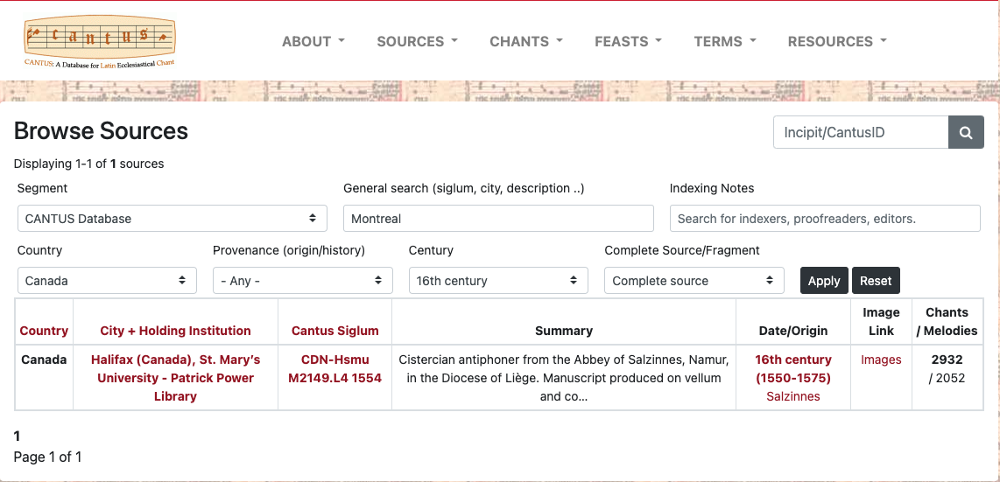

# nl-to-sql Project Setup
1. Navigate to the project directory and sure that <directory-structure>:
   ```bash
   cd */nl-to-sql/NL2SQL
   ```
2. Run the script using the virtual environment:
    ```bash
   <path-to-venv>.venv/bin/python <directory-structure>/NL2SQL/main_pipeline.py
   ```

# CantusDB Setup

1. Clone the [CantusDB repository](https://github.com/DDMAL/CantusDB) and ensure it is up to date by regularly pulling the latest changes.
2. Follow the instructions on the [Deploying CantusDB Locally for Development](https://github.com/DDMAL/CantusDB/wiki/Deploying-CantusDB-locally-for-development#collecting-static-files) page to set up the website for local development.
3. Obtain the `dev_env` file from the `CantusDB Resources` section. This file must be provided by a CantusDB developer.
4. During the *Populating the Database* step, request the `cantus_dump.sql` file from a CantusDB developer and use it to populate the database.
5. Verify that the setup is complete by confirming that the `Chants`, `Sources`, and `Feasts` sections are accessible via `localhost`.

# Middleware Setup

1. Confirm that the *CantusDB Setup* is complete and the website is functional.
2. Place the `middleware.py` file into the `*/CantusDB/django/cantusdb_project/cantusdb/` directory.
3. Navigate to the `Chants`, `Sources`, or `Feasts` page on the CantusDB website, input search criteria, and click *Apply*.
4. The `middleware.py` script will automatically generate and populate the `nlq_sql.json` and `sql_queries.log` files located in `*/CantusDB/django/cantusdb_project/` directory.
5. Each new search performed on the CantusDB website will update the data in `nlq_sql.json` and `sql_queries.log`.
6. Note that not all SQL queries in these files are relevant. Focus on the query that matches the search results displayed on the website.
7. Refer to the *SQL Output Extraction* section for additional instructions.

# SQL Output Extraction
## Extracting Ground Truth Data
1. On the localhost version of the website, navigate to the `Chants`, `Sources`, or `Feasts` pages and enter the desired search information. For example:
   - **Segment**: `CANTUS Database`
   - **General search**: `Montreal`
   - **Country**: `Canada`
   - **Century**: `16th century`
   - **Complete Source/Fragment**: `Complete source`

   Observe that only one result is returned for this search.

   

2. Open the `*/CantusDB/django/cantusdb_project/nlq_sql.json` file and locate the query that matches the inputted search criteria. Look for:
   - A query starting with `SELECT DISTINCT`
   - Conditions such as:
     ```
     UPPER(main_app_institution.country::text) LIKE UPPER('%Canada%')
     AND UPPER(main_app_century.name::text) LIKE UPPER('%16th century%')
     AND UPPER(main_app_institution.name::text) LIKE UPPER('%Montreal%')
     ```
   - A query ending with:
     ```
     ORDER BY main_app_institution.siglum ASC, main_app_source.shelfmark ASC LIMIT 1;
     ```

3. Before executing the SQL query on the Docker Postgres container, remove the trailing `LIMIT 1` from the query. This precaution should be taken for all queries to ensure complete results are retrieved.
4. Ensure the database container for the website is running, then run the following Docker command to extract information into a file:

   ```bash
   docker exec cantusdb-postgres-1 psql -U cantusdb -d cantusdb \
   -c "\pset format csv" -c "GOLD_SQL_QUERY" | sed '1d' > */Path-to-the-Repository/nl-to-sql/NL2SQL/gold_outputs/object/object_output_filex.csv
   ```

5. When running the Docker command, replace `GOLD_SQL_QUERY` with the SQL query obtained from the search, update the path information appropriately, and ensure that the object is one of `chants`, `sources`, or `feasts`.

6. Ensure that the `object_output_filex.csv` follows the correct naming convention:
   - `object_output_filex` should be `c`, `s`, or `f` for `chants`, `sources`, or `feasts`, respectively.
   - The `x` value represents the index number of the file within that directory.

7. If everything is formatted correctly, the `object_output_filex.csv` file will be generated in the specified directory.

8. Copy and paste the gold SQL query and the gold output path into the appropriate `chants.json`, `sources.json`, or `feasts.json` file. Add them to the `sql_query` and `gold_output_path` fields.

9. Write the natural language query corresponding to the gold SQL query. Ensure that:
   - It starts with: *Given this database schema, generate a SQL query that shows me all the*.
   - It ends with: *Format your response without any formatting or newlines.*
   - Values are enclosed in single quotes (e.g., `'Canada'`).
   - Attribute names are capitalized (e.g., `Country`).


## PREDICTED
docker exec cantusdb-postgres-1 psql -U cantusdb -d cantusdb -c "\pset format csv" -c "SELECT main_app_source.* FROM main_app_source JOIN main_app_institution ON main_app_source.holding_institution_id = main_app_institution.id JOIN main_app_segment ON main_app_source.segment_id = main_app_segment.id WHERE main_app_segment.name = 'CANTUS Database' ORDER BY main_app_institution.siglum, main_app_source.shelfmark;" | sed '1d' > ~/Developer/NLP/nl-to-sql/NL2SQL/predicted_outputs_without_options/sources/gpt/s1.csv

# Links
- CantusDB: https://github.com/DDMAL/CantusDB
- CantusDB Wiki: https://github.com/DDMAL/CantusDB/wiki/


